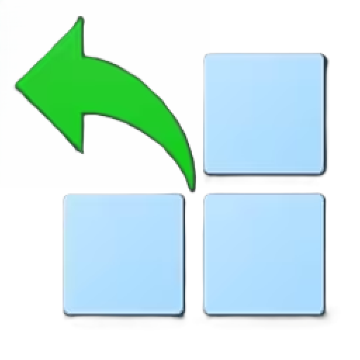

  

  <h1 align="center">
  Class Widgets CSV import
</h1>

 让我们用.csv表格编辑 Class Widgets 课表！将.csv文件转换为 Class Widgets Json 课表

> [!TIP]
> 本软件已加入插件广场，可前往 Class Widgets 插件广场 下载

> [!IMPORTANT]
> 本软件可作为软件直接使用，请下载`Class-Widget-CSV-import.exe`  
> 若要作为插件使用，请在 Class Widgets 插件管理器中打开`"Class Widget Csv import"插件设置`

## 特点
软件无依赖，单文件即可运行，支持作为插件使用

## 功能与计划
- [x] 时间线转化
- [x] 课程表转化
- [x] 时间分区
- [x] 支持中文
- [x] 支持 Class Widgets 插件
- [ ] 单双周课表
- [ ] 每日时间线功能

## 环境
||测试环境|建议|最低限度|
|:-:|:-:|:-:|:-:|
|操作系统|Windows 11|Windows 10+|未知(Maybe Windows XP?)|
|系统位数|x64|x64|未知(Maybe x86?)|

## 相关项目
[Class Widgets](https://github.com/Class-Widgets/Class-Widgets)
